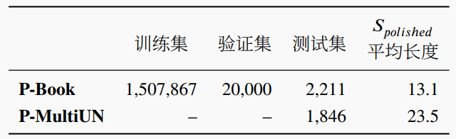

# 成语润色

《成语润色：任务、数据集与预训练基线模型》论文中构建的成语润色数据集

## 简介

该文提出了文本润色的任务，其目标是在保留输入句子原本语义的前提下生成表达更为优美的句子。文本润色在现实应用中具有很大价值，是现代智能写作辅助系统的重要组成部分。但是现有文献对文本润色的研究却鲜有涉及，在这个重要方向上的进一步研究需要更为正式的任务定义，基准数据集和强大的基线模型。该文以中文成语润色为例对文本润色任务进行了研究：首先，将文本润色任务形式化为一个上下文相关的序列到序列的文本生成问题；其次，为了解决任务数据标注困难的问题，提出了一种基于人机协作的半自动数据构建方法，并使用该方法创建了一个包括150万条数据的大规模中文文本润色数据集；最后，针对文本润色任务提出了两类特定于任务的预训练目标，并使用这些目标训练了一系列基于Transformer 的预训练模型作为文本润色任务的基线模型。通过使用基线模型在创建的文本润色任务数据集上进行了广泛的实验，取得了一些重要的发现。人工评测则进一步展示了提出的基线模型具有较好的文本润色能力。

## 数据集

本论文中构建的成语润色数据集统计信息如下表所示。数据集[下载链接](https://stduestceducn-my.sharepoint.com/:f:/g/personal/liaojunwei_std_uestc_edu_cn/Em2o8jNJck1MqWKbxnHjfxEBLSOr5hRnH2W9TnEbxxGBqg?e=f6lWRa)



## 数据格式

每个数据集对应一个json文件，文件中的一行举例如下：

```json
{"source": "马援就不大高兴，认为自己的功劳不足以有此封赏，孟翼应该说些居安思危的话来。于是马援说：“边疆战事未歇，#你不应该想着名利#，男儿要当死于边野，以马革裹尸还葬耳。”马革裹尸，即形容为国作战，决心为国捐躯的意志", "target": "不应想着功名利禄"}
```

`source`字段是包含上下文和待润色文本的句子，其中两个`#`之间是待润色的文本。
`target`字段是使用成语对待润色文本进行润色后的句子。
